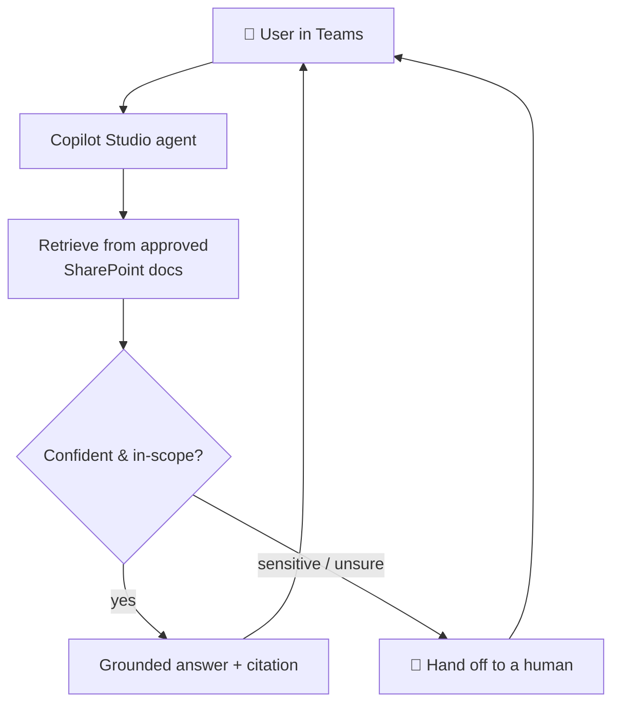

# Case study — Professional-services support agent

## Problem
A professional-services firm's staff lost hours every week asking HR and IT the same
routine questions, and they were nervous about AI giving wrong or unsafe answers on
sensitive matters (refunds, HR disputes, security). They wanted an assistant that was
*accurate, cited, and knew when to step back*.

## Approach
A Copilot Studio agent grounded only in the firm's approved SharePoint documents,
with citations on every answer and explicit escalation rules: sensitive topics and
low-confidence questions go to a human instead of being guessed.

## Result
Routine questions answered instantly with sources staff can verify; sensitive topics
safely routed to people. Data stays in-tenant and is never used to train public
models (configured per asset 04).

## How I'd do this for you
The simulator in `sim/` already demonstrates this exact behaviour offline. For your
project I build the agent in Copilot Studio over your SharePoint (per
`deploy-guide.md`), tune the topics/escalation to your business, configure privacy,
publish to Teams or web, and hand it over with docs. See `OFFER.md` for packages.
