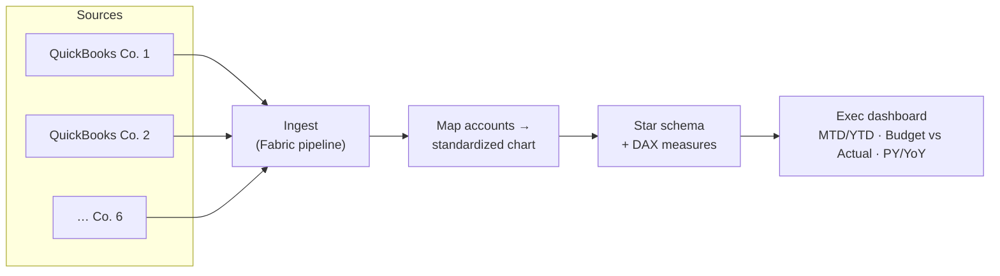

# Case study — Consolidating six campground companies

## Problem
An operator ran six KOA campgrounds, each its own QuickBooks Online company with a
*similar but not identical* chart of accounts. Leadership wanted one consolidated
view — MTD/YTD, Budget vs Actual, Prior Year — but couldn't get it without manually
re-keying spreadsheets every month, and the account names never lined up.

## Approach
Map each entity's accounts to one standardized reporting chart, consolidate into a
single fact table, and build the executive measures once so every entity reports the
same way.

## Result
One consolidated dashboard across all entities, refreshed automatically — no more
manual re-keying, and every company measured on the same chart of accounts. Budget
variance and YoY growth are visible at a glance.

## How I'd do this for you
The offline model here (`run.py`) already consolidates three mock entities and renders
the dashboard with Budget vs Actual and YoY — proof the logic and measures are right.
For your project I wire the real QuickBooks sources into Fabric, build the mapping and
star schema, and ship the DAX measures from `dax-library.md`. See `OFFER.md`.
