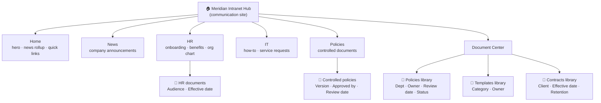

# Case study — A modern intranet for a mid-size services firm

> Seeded from a realistic engagement. Names changed; the architecture is the one
> this asset ships.

**Client:** Meridian Advisory — a ~180-person professional-services firm (three
offices) running Microsoft 365 E3. No real intranet; documents lived in personal
OneDrives, a sprawling "Company" Teams team, and an old file share.

## Problem

- Staff couldn't find the current expense policy, the latest org chart, or the
  onboarding checklist — three different "final" versions of each were circulating.
- HR and IT fielded the same questions every week because there was no single
  place to publish answers.
- "Where's the document?" was the most-asked question in the company, and there was
  no metadata, no ownership, and no retention — just folders inside folders.
- Leadership wanted a branded home page with company news, but nobody owned it.

## Approach

I treated it as an **information-architecture** problem first, not a SharePoint
build. We agreed on six top-level sections — **Home, News, HR, IT, Policies,
Document Center** — and I captured the whole structure as a declarative blueprint
(`site-definition.json`): sites, libraries, the metadata columns each library
needs, navigation, pages, and a permissions model.

Before building anything in the tenant, I ran the offline generator and sent
Meridian a **clickable static preview** of the proposed intranet. They reviewed it
in a 30-minute call, asked for two section renames and an extra "Templates"
library, I edited the blueprint, regenerated, and got sign-off the same day.

## Architecture

A single **communication-site hub** with the sections associated to it, so they
share navigation and theme but keep independent permissions. The Document Center is
metadata-driven (content type + columns), not folder-driven.

Each library carries a **content type** and **metadata columns** instead of nested
folders, so a document is found by filtering ("show me HR policies due for review")
rather than by remembering where someone filed it. Retention labels were applied to
Contracts and Policies; everything else inherits a default.

## Result

- One home for the company: news, the six sections, and a single Document Center.
- "Where's the document?" dropped off — staff filter by department/owner/status
  instead of hunting folders.
- 11 controlled policies migrated with owners and review dates set, so HR gets an
  automatic prompt before a policy goes stale.
- The blueprint is version-controlled, so the next office rollout was a copy-edit of
  the JSON, not a rebuild.

## How I'd do this for you

I start from this exact blueprint and tailor it to your sections and documents,
send you the **offline preview for sign-off first**, then build it in your tenant
with the permissions and governance model in [`governance.md`](governance.md).
Typical mid-size intranet: a couple of weeks end to end, including a recorded
handover so your team can run it without me.
