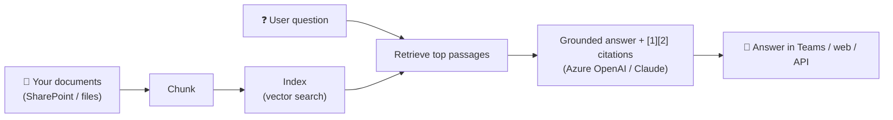

# Case study — Internal policy Q&A bot

## Problem
A services firm's staff kept asking HR and IT the same questions ("how much PTO do I
get?", "who do I email about a phishing message?"). Answers lived in scattered PDFs
nobody read. The team wanted a chatbot that answers from the official documents — and
shows where each answer came from, so people trust it.

## Approach
A retrieval-augmented generation (RAG) pipeline: ingest the documents, chunk them,
index for semantic retrieval, and have the model answer **only** from the retrieved
passages, with inline citations and a sources list.

## Result
Staff self-serve the common questions; every answer links to the source paragraph,
so HR/IT stop fielding repeats and employees trust the bot. Data stays in-tenant and
is never used to train public models.

## How I'd do this for you
This accelerator is the working core (`ragkit.py`) — it runs today over sample docs
with citations. For your project I point it at your documents, swap the local index
for production vector search, wire your real model and chat surface, and add an
evaluation set so you can measure answer quality. See `OFFER.md` for packages.
