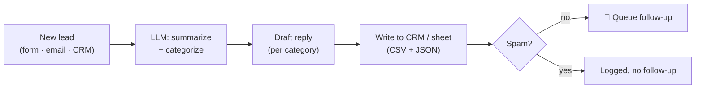

# Case study — AI triage for inbound leads

## Problem
A small B2B team was getting inbound from a web form, a shared inbox, and their
CRM. Someone read every message, guessed whether it was a sales lead, a support
issue, or noise, and copied the good ones into the CRM by hand. Quotes sat for a
day, support requests got lost behind spam, and nothing was auditable.

## Approach
A single AI workflow: each new lead is summarized and categorized by an LLM
(quote / support / partnership / billing / spam), given a category-specific drafted
reply, written to the CRM, and — unless it's spam — queued as a follow-up. A safe
default routes anything ambiguous to a human instead of guessing.

## Result
Every lead is categorized within seconds, logged with a summary, and given a draft
reply the team can send in one click. Spam is recorded but never followed up. In
the simulator: **6 leads in, 5 follow-ups drafted, 1 spam suppressed** — the exact
behaviour the real automation guarantees.

## How I'd do this for you
`pipeline.py` runs this logic offline today (deterministic, no keys). For your
project I build it in your tool of choice — the node-by-node mapping for Make.com,
Zapier, n8n, and Power Automate is in `blueprint.md` — wire your real LLM key,
test on your samples, and hand it over documented. See `OFFER.md` for packages.
