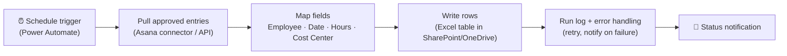
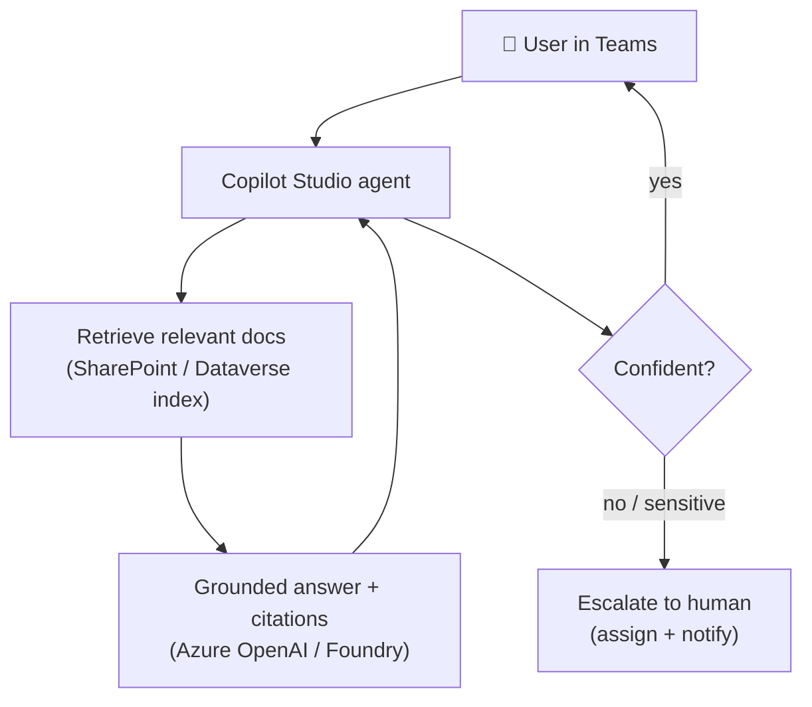
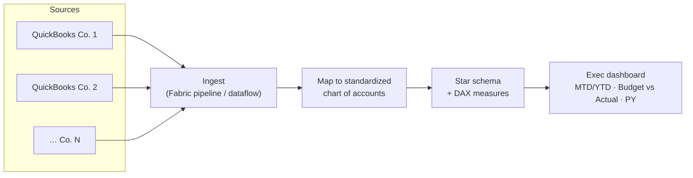

# Architecture diagram templates (Mermaid)

Edit these per client. Render on GitHub, in VS Code (Mermaid extension), or at
<https://mermaid.live> → export PNG for decks.

## A. Scheduled data-sync automation (e.g. Asana → SharePoint/Excel)

## B. Copilot Studio agent over enterprise docs (RAG)

## C. Multi-entity BI consolidation (Fabric / Power BI)

> Tip: keep the diagram to one screen. If it needs more, split into a context
> diagram + a per-component detail diagram.
