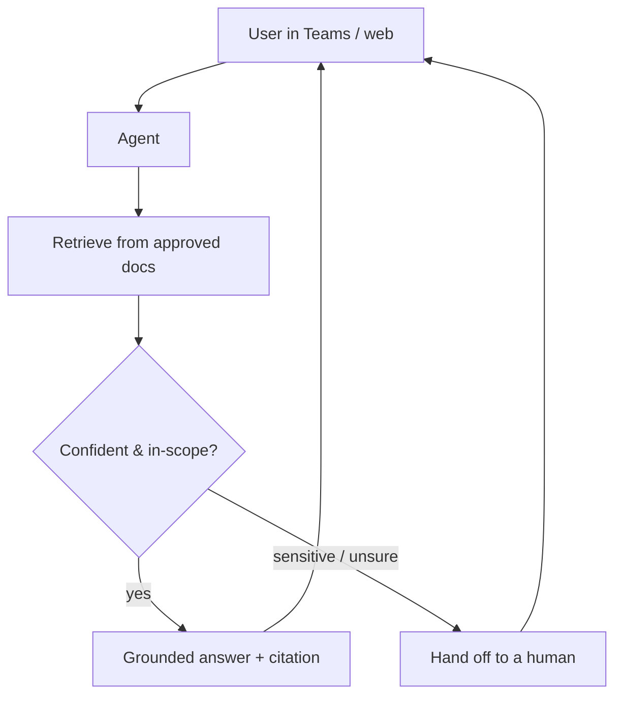

# Copilot Studio support agent

A Microsoft 365 AI agent that answers staff and customer questions from your
SharePoint documents, **cites its sources**, and **hands off to a human** when it's
unsure or the topic is sensitive.

This repo includes a fully offline simulator so you can see the exact behaviour
without a tenant or API keys — `python sim/run.py` just runs.

## The problem it solves

Teams lose hours every week answering the same routine HR/IT questions, and most are
(rightly) nervous about an AI giving wrong or unsafe answers on sensitive matters —
refunds, HR disputes, security. The agent here is built around three guarantees:
answers are **grounded only in approved documents**, every answer **carries a
citation**, and sensitive or low-confidence questions **escalate to a person**
instead of being guessed.



## Run the simulator

```bash
python sim/run.py            # grounded answers + two escalation cases
python -m pytest sim/tests/ -q
```

You'll see it answer "how do I reset my password?" from the IT FAQ *with a citation*,
route a PTO question to the HR doc, and **escalate** a refund request (sensitive) and
an off-topic question (low confidence) rather than inventing an answer.

The simulator is stdlib-only and deterministic. A real model plugs in behind one
`complete()` interface via an `LLM_PROVIDER` environment variable — no code changes,
and no keys needed to run the demo.

## What's inside

| Path | Purpose |
|------|---------|
| `sim/` | Offline simulator: retrieval, citations, escalation policy + tests. |
| `sim/data/` | Sample HR / IT / security docs the agent answers from. |
| `agent-template/` | The declarative agent design (`agent.yaml`, `topics.json`, `prompt-library.md`) you recreate in Copilot Studio. |
| `deploy-guide.md` | Step-by-step tenant build + go-live checklist. |

## Taking it to a real tenant

Build the agent in Copilot Studio following `deploy-guide.md`, point it at the
client's SharePoint, tune the topics and escalation rules to their business, and
publish to Teams or the web. The simulator's question set doubles as the acceptance
test.
