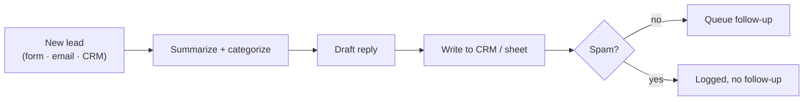

# No-code AI lead workflow

The pattern behind "AI automation" projects: a lead arrives (web form, email, CRM) →
an LLM **summarizes and categorizes** it → drafts a context-aware **reply** → it's
written to a **CRM/sheet** → a **follow-up** is queued, with spam filtered out and a
safe "send to a human" default so nothing is mis-routed.

Buildable in Make.com / Zapier / n8n / Power Automate — proven here as runnable code,
with a node-by-node mapping to each of those tools in `blueprint.md`.

## The problem it solves

Inbound arrives from a form, a shared inbox, and a CRM, and someone reads every
message to decide whether it's a sales lead, a support issue, or noise — then copies
the good ones into the CRM by hand. Quotes sit for a day; support gets lost behind
spam. This triages every lead in seconds and drafts the reply, while logging spam but
never following up on it.



## Run it

```bash
python run.py                # 6 leads in, 5 follow-ups drafted (1 spam suppressed)
python -m pytest -q
```

You'll see each lead categorized (quote / support / partnership / billing / spam),
summarized, and given a drafted reply — with the spam lead written to the CRM but
**excluded** from follow-ups. Output lands in `out/`.

## What's inside

| Path | Purpose |
|------|---------|
| `pipeline.py` | The workflow: classify → summarize → draft → CRM write → follow-up. |
| `data/leads.json` | Six sample leads across three channels (incl. one spam). |
| `blueprint.md` | Node-by-node mapping onto Make.com, Zapier, n8n, and Power Automate. |

## Building it for real

The default classifier/answerer is a deterministic stub so the demo runs without
keys; a real LLM plugs in behind one `complete()` interface via `LLM_PROVIDER`. To
ship it, follow `blueprint.md` to recreate the steps in the client's existing
automation tool, wire their LLM key, and test on their real messages first.
