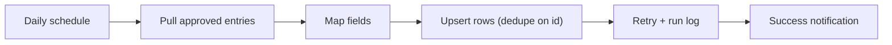

# Power Automate flow pack

Reusable Power Automate patterns for Microsoft 365 automation — pull data on a
schedule, map fields, write it to an Excel table in SharePoint, with **retry**,
**de-duplication**, and a **run log** baked in.

Includes an offline simulator that proves the logic without a tenant: `python
sim/run.py` runs the scheduled-sync flow end to end, including a forced transient
failure so you can watch the retry and idempotency work.

## The problem it solves

A team had approved time entries in Asana but payroll needed them in an Excel table
in SharePoint — and someone was copying rows by hand every week. Naive automations
break in two predictable ways: they duplicate rows on re-runs, and they fail silently
on a transient timeout. This pattern fixes both.



## Run the simulator

```bash
python sim/run.py            # run 1 retries on a transient failure; run 2 is idempotent
python -m pytest sim/tests/ -q
```

Run 1 pulls five entries, keeps the four approved, **fails the write once** (a
simulated connector timeout) and recovers on retry. Run 2, same data, adds **zero**
rows because they already exist. Every step lands in the run log.

## What's inside

| Path | Purpose |
|------|---------|
| `flows/` | Documented flow definitions: `scheduled-sync`, `approval`, a reusable `error-handling` sub-pattern, and an example field-mapping config. |
| `import-guide.md` | Build/import steps + a test-with-sample-data-first checklist. |
| `sim/` | Offline simulator of the scheduled-sync flow + tests (stdlib-only). |

## Taking it to a real tenant

Build the flow in Power Automate from the templates in `flows/`, following
`import-guide.md`. Test against a sandbox source and destination first, then hand it
over documented. Same logic, same guarantees as the simulator.
