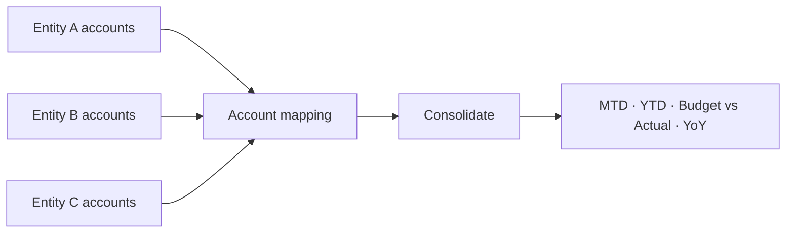

# Power BI / Fabric multi-entity consolidation

Consolidate several companies with **different charts of accounts** into one
executive view — MTD, YTD, Budget vs Actual, and prior-year comparison — then build
it for real in Microsoft Fabric / Power BI with the included DAX library.

The consolidation logic runs fully offline here: `python run.py` ingests three mock
QuickBooks entities, maps them to one standardized chart, and renders an HTML
dashboard.

## The problem it solves

An owner runs several entities, each with its own bookkeeping and slightly different
account names ("Wages" vs "Payroll" vs "Labor"). Getting one consolidated P&L means
hours of manual spreadsheet work every month, and the numbers never quite tie out.
This maps every entity to a single standardized chart of accounts and consolidates
deterministically.



## Run it

```bash
python run.py                # writes out/dashboard.html + out/consolidated.csv
python -m pytest -q
```

Sample result: **YTD revenue $732,240**, **+3.1%** vs budget, **+8.0%** YoY, across
three entities — with MTD, YTD, Budget-vs-Actual and prior-year columns by category.
Open `out/dashboard.html` to view the rendered dashboard.

## What's inside

| Path | Purpose |
|------|---------|
| `generate_data.py` | Builds the three mock entities (deterministic). |
| `consolidate.py` | The consolidation engine (mapping → facts → measures). |
| `run.py` | Runs it and renders the HTML dashboard. |
| `dax-library.md` | The DAX measures (YTD, MTD, PY, YoY, Budget vs Actual) for the real Power BI model. |
| `account-mapping.example.csv` | Template for mapping a client's accounts to the standard chart. |

## Taking it to a real client

Build the model in Microsoft Fabric / Power BI, refreshing from the client's real
QuickBooks (or other) companies, using the measures in `dax-library.md` and their
account mapping. The offline run is the proof of the consolidation logic.
