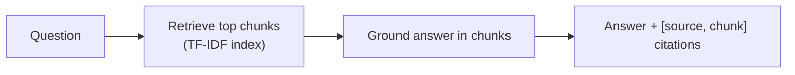

# RAG-over-your-docs kit

A retrieval-augmented-generation kit that answers questions from a set of documents
and **cites the exact source document and chunk** for every answer — the
auditability a business needs before it trusts an AI over its own knowledge base.

Pure Python standard library, no dependencies, no keys: `python run.py` runs the
whole retrieve → ground → cite loop offline.

## The problem it solves

"Chatbot over our docs" projects fail when the bot makes things up or can't show
where an answer came from. This kit is built citation-first: it retrieves the most
relevant chunks with a TF-IDF index and grounds the answer in them, returning the
source for each so a human can verify it.



## Run it

```bash
python run.py                # answers sample questions with sources
python -m pytest -q
```

Ask "what is the refund policy?" and it answers from `refunds.md` with the citation;
ask about PTO and it pulls from `hr-policy.md`. Every answer lists the source
documents and chunk indexes it used.

## What's inside

| Path | Purpose |
|------|---------|
| `ragkit.py` | The kit: tokenize, chunk, TF-IDF index, retrieve, answer with citations. |
| `data/` | Sample documents (HR, refunds, security) to index. |
| `run.py` | Runs sample queries end to end. |

## Swapping in a real model

The default answerer is a deterministic local stub so the demo is reproducible
without keys. A real LLM (Azure OpenAI / Anthropic) plugs in behind one `complete()`
interface via `LLM_PROVIDER` — the retrieval, chunking, and citation layer stay
exactly the same. Point it at a client's document set and host it (e.g. an Azure
function or a Copilot Studio knowledge source).
