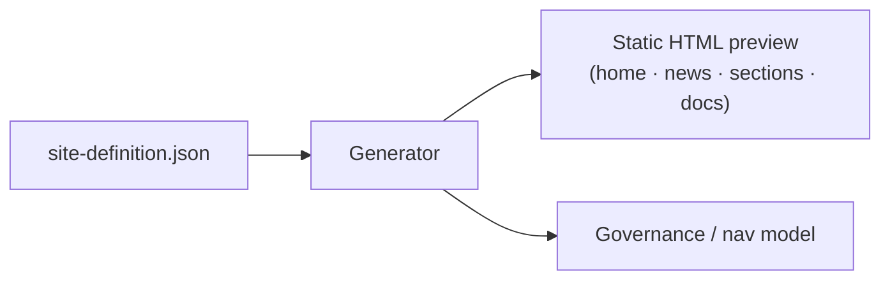

# SharePoint intranet generator

Generate a complete modern intranet — home, news, section pages, and a document
center — from a single `site-definition.json`, with a static HTML preview you can
review before anything is provisioned in a real tenant.

`python run.py` produces the full site as browsable HTML.

## The problem it solves

SharePoint intranet projects stall in design-by-committee: stakeholders can't picture
the structure, so navigation, page layout, and governance get argued in the abstract.
Driving the whole site from one definition file means you can preview and iterate on
the structure in minutes, agree it, then provision the real thing from the same
source of truth.



## Run it

```bash
python run.py                # writes out/index.html + section pages
python -m pytest -q
```

Open `out/index.html` to browse the generated intranet — a hero, company news cards,
section pages (HR, IT, Policies), and a document center, all from the definition
file.

## What's inside

| Path | Purpose |
|------|---------|
| `site-definition.json` | The single source of truth: site, nav, sections, news, documents. |
| `intranet_gen/` | The generator (model → render). |
| `run.py` | Builds the static HTML preview. |
| `governance.md` | Information-architecture + governance guidance. |
| `deploy-guide.md` | How to provision the real SharePoint site from the definition. |

## Taking it to a real tenant

Agree the structure from the HTML preview, then provision the modern SharePoint site
(communication site, hub nav, document libraries) per `deploy-guide.md`, using the
definition file as the spec.
